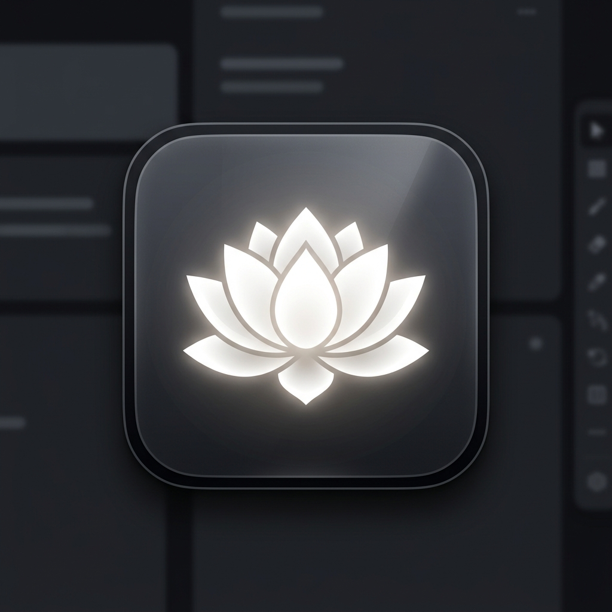

# 🧘‍♂️ Zen Mode for AgentZero

**Zen Mode** is a premium UI/UX plugin that transforms your AgentZero workspace into a highly-focused, distraction-free environment. 

With a simple floating action button and intuitive hotkeys, Zen Mode instantly hides all sidebars, navigation headers, and extra UI elements. Your chat interface takes center stage, allowing you to focus purely on the conversation.



## 🌟 Features

- **One-Click Focus**: A beautiful, glassmorphism floating toggle at the bottom-right of your screen.
- **Power User Hotkeys**: Press `Ctrl + Shift + Z` to toggle Zen Mode instantly. Press `Esc` twice quickly to exit.
- **Seamless Integration**: Built entirely with AgentZero's native Alpine.js store for instant, flicker-free persistence across reloads.
- **Premium Aesthetics**: Smooth CSS transitions eliminate layout snapping.

## 🚀 Installation

1. Install via the **AgentZero Plugin Hub**.
2. Or, clone this repository directly to your `usr/plugins/` directory:
   ```bash
   git clone https://github.com/AATheBuilder/a0-zen-mode-plugin.git zen_mode_plugin
   ```
3. Enable "Zen Mode" in **Settings → Plugins**.
4. Refresh the page!

## 🛠️ Requirements
- AgentZero version with Plugin Support (built on OpenWebUI).

## 📄 License
MIT
